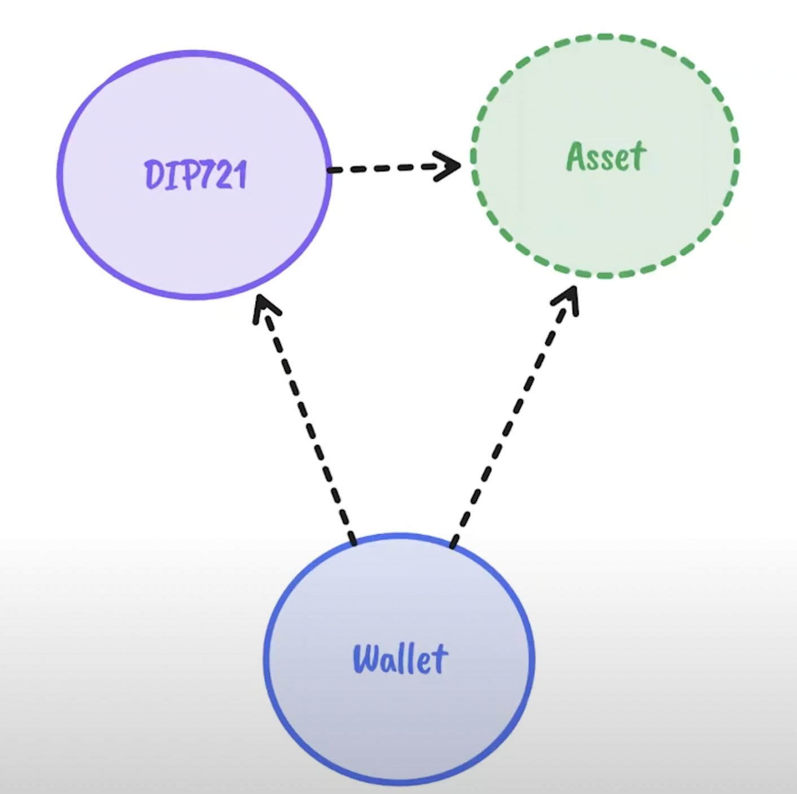

# Dapp: NFT based on icp
> [ICP NFT youtube link](https://www.youtube.com/watch?v=1po3udDADp4)

## 1. Overview
> What will handle

1. How to create and deploy NFTs on the Internet Computer using rust
2. How to manage NFTs using wallet canister and Internet Identify for authentication

## Structure

There are 3 canisters to handle.

1. Minting Canister (`DIP-721`)
    - `ERC-721` style non fungible token standard adapted to the Internet Computer
    - to mint an NFT of a digital asset.
2. `Asset Canister`
    - host the digital media
    1. Hosting 
3. `Wallet Canister`
    - check authentication 

## `Asset Certification`

- [further reading for `Asset certification`](https://internetcomputer.org/how-it-works/asset-certification/)

- [`ic-certified-assets` source code](https://github.com/dfinity/sdk/tree/master/src/canisters/frontend/ic-certified-assets)