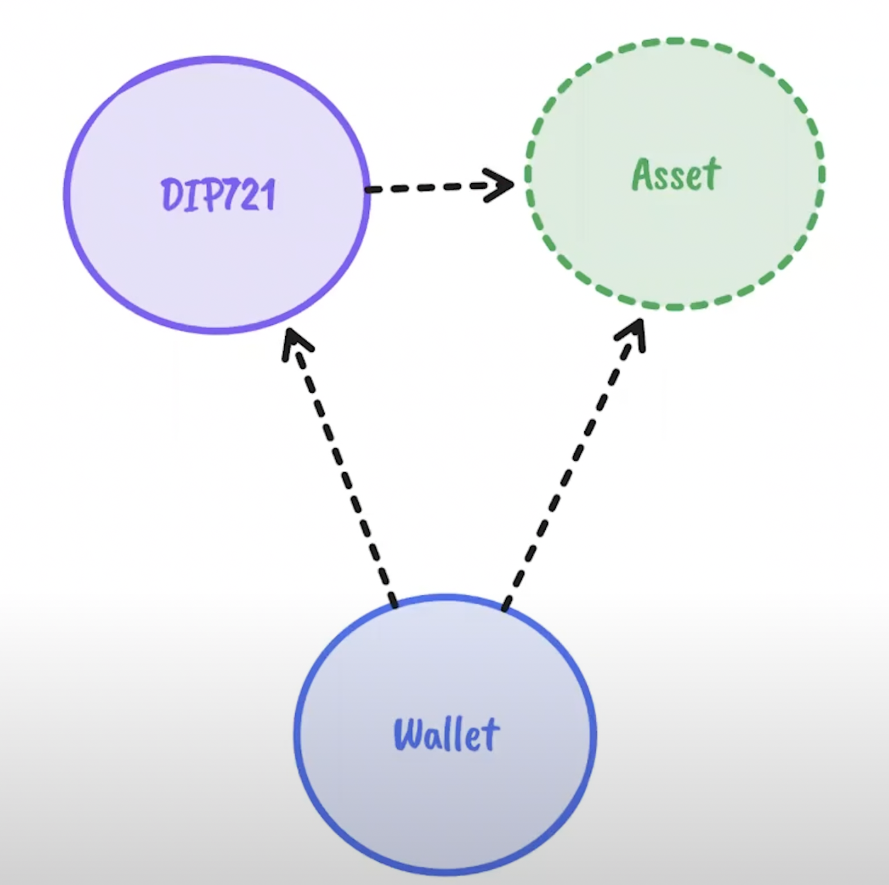
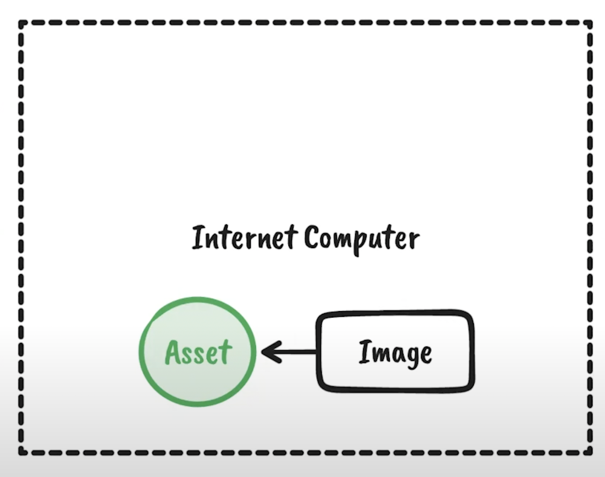
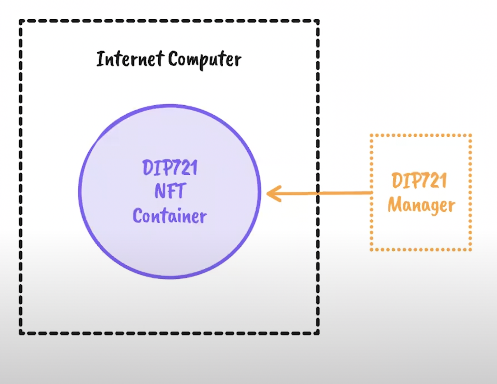
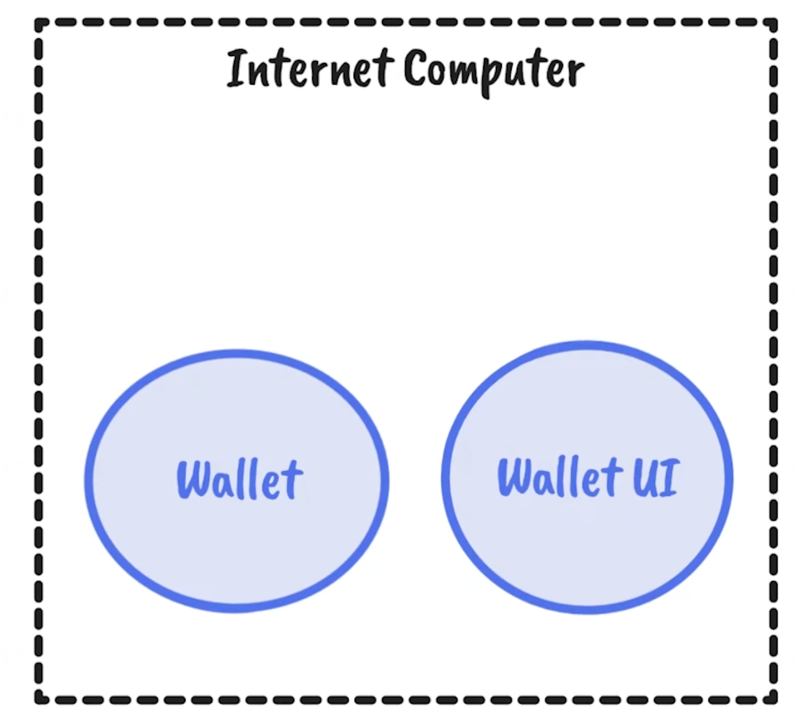

# Dapp: NFT based on icp
> [ICP NFT youtube link](https://www.youtube.com/watch?v=1po3udDADp4)

## 1. Overview
> What will handle

1. How to create and deploy NFTs on the Internet Computer using rust
2. How to manage NFTs using wallet canister and Internet Identify for authentication

## Structure

There are 3 canisters to handle.

1. `Asset Canister`
    - host the digital media
    - Hosting 
2. Minting Canister (`DIP-721`)
    - `ERC-721` style non fungible token standard adapted to the Internet Computer
    - to mint an NFT of a digital asset.
3. `Wallet Canister`
    - check authentication 

## 1. Asset Canister
> Asset canister is a type of canister that serves certified static assets.

It is primarily used to serve user interfaces written in javascript. It can also be used to serve plain static content.

#### `Asset Certification`

- [further reading for `Asset certification`](https://internetcomputer.org/how-it-works/asset-certification/)

- [`ic-certified-assets` source code](https://github.com/dfinity/sdk/tree/master/src/canisters/frontend/ic-certified-assets)

## 2. Minting Canister
> DIP721 Canister to create an NFT and store its metadata on-chain.

There are two directories on source code.

1. `DIP721 NFT Container`(canister)
    - It is the canister with the smart contract code.
    - This is what gets deployed on IC
    - This is what stores the NFTs and facilitates the DIP721 tx around them.
2. `DIP721 Manager`
    - A collction of a rust-based utilities that make the minting process easier.
    - Makes calls to the `NFT canister` with properly formatted args.

## 3. Wallet Canister

Wallet impl is composed of two canisters.

1. Asset Canister (`Wallet UI`)
    - That serves the user interface assets(html, js, css) that gives the application functionality through a browser.
2. `Record-keeper` (`Wallet`)
    - keep record of the custodians who have access to the wallet and the NFTs that the wallet owns.
    - **exposes api** to perform actions such as below.
        1. registering
        2. burning
        3. transferring
        4. querying NFTs